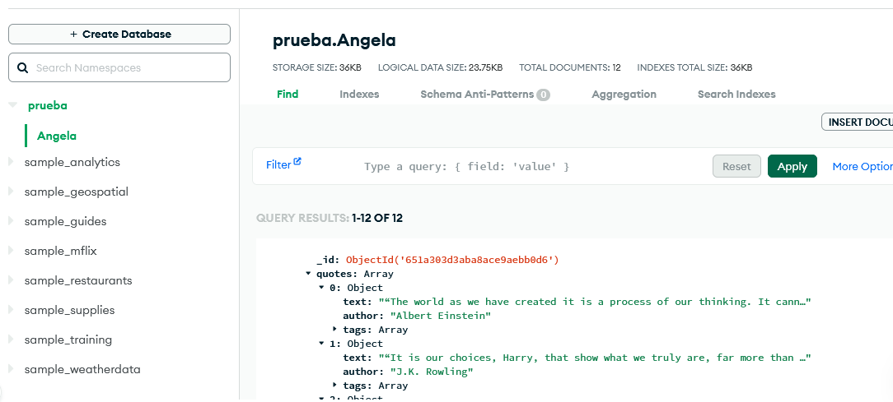
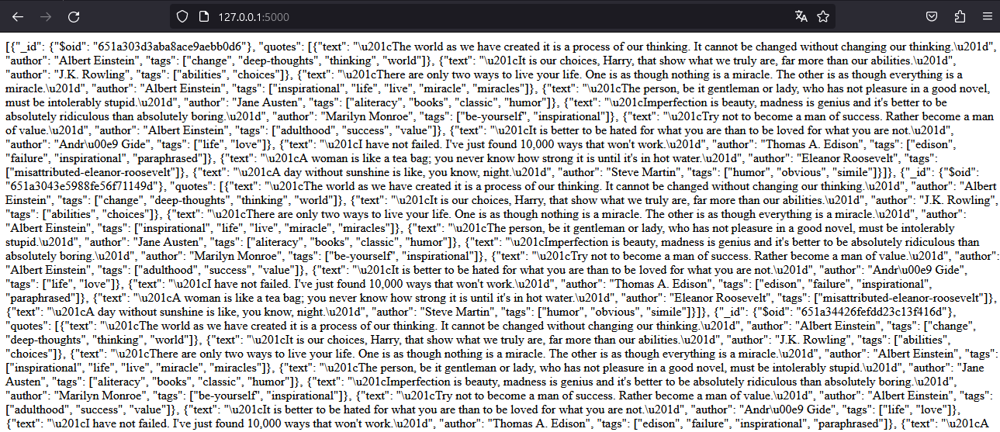

# prb1
# Prueba Final Tratamiento de Datos

Extraer datos de la página http://quotes.toscrape.com/, almacenarlos en una base de datos y visualizar

### Paso 1:

Crear un archivo `.env` para confidencialidad de usuarios y contraseñas

commandline
mongo_user=username # remplace con su usuario
mongo_passw=password # remplace con su contraseña

### Paso 2:

Instalar las librerías necesarias

commandline
pip install -r requirements

### Paso 3

Ejecutar `prueba.py`

commandline
python3 prueba.py

## Paso 4

Chequear los resultados en MongoDB

## Paso 5

Chequear los datos obtenidos de la base de datos y visualizados mediante flask
