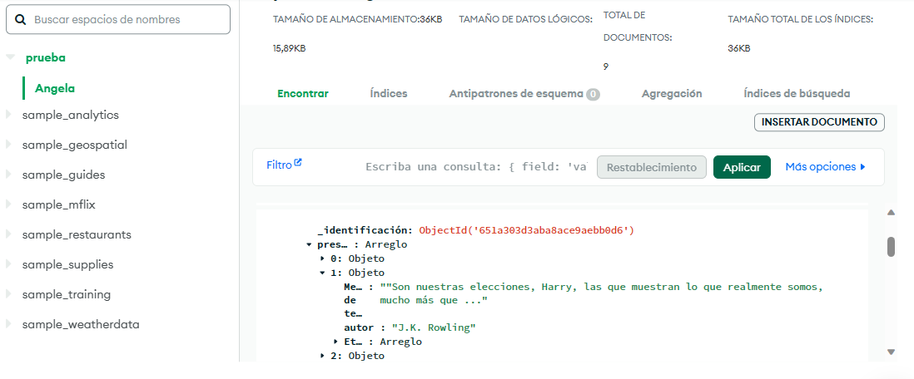

# prb1
# Prueba Final Tratamiento de Datos

Extraer datos de la página http://quotes.toscrape.com/, almacenarlos en una base de datos y visualizar mediante Flask

### Paso 1:

Crear un archivo `.env` para confidencialidad de usuarios y contraseñas

commandline
MONGO_USER=username # remplace con su usuario
MONGO_PASSWORD=password # remplace con su contraseña
MONGO_HOST=cluster0.patata.mongodb.net # remplace con su host

### Paso 2:

Instalar las librerías necesarias

commandline
pip install -r requirements

### Paso 3

Ejecutar `prueba.py`

commandline
python3 prueba.py

## Paso 4

Chequear los resultados en MongoDB

## Esquema de ejecución